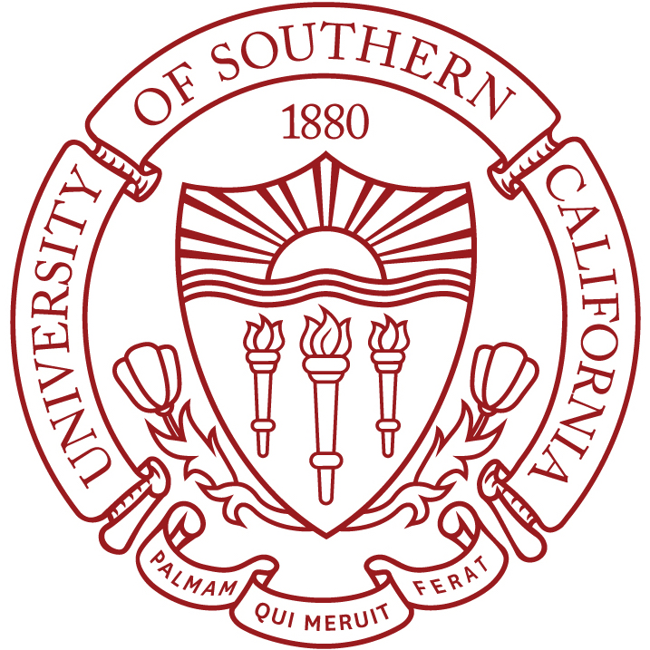

## About Me
I am a Ph.D. candidate in Biostatistics at University of Pittsburgh, advised by [Lu Tang](https://publichealth.pitt.edu/home/directory/lu-tang) and [Gong Tang](https://publichealth.pitt.edu/home/directory/gong-tang). I was a visiting student in Computer Science at Carnegie Mellon University from 2019 to 2021. I obtained my B.S. in Pharmacy and Computer Science at Sun Yat-sen University in 2018. 

My research interest lies in developing novel statistical and machine learning methods in <strong>causal inference</strong>, <strong>data integration</strong>, and <strong>decision fairness</strong>. 

I am currently a Graduate student researcher at [NRG Oncology](https://www.nrgoncology.org/). I interned at [Eli Lilly and Company](https://www.lilly.com/) working with [Shu Yang](https://shuyang.wordpress.ncsu.edu/) and [Ilya Lipkovich](https://scholar.google.com/citations?user=m4bEhasAAAAJ&hl=en) in summer 2021. I also work with [Timothy Girard](https://ccm.pitt.edu/?q=content/girard-timothy) at Department of Critical Care Medicine, University of Pittsburgh. 

I enjoy volunteering. As well as being am a weekly cat care volunteer at [Humane Animal Rescue](https://www.humaneanimalrescue.org/), I am a pro-bono consultant at [Fourth River Solutions](http://www.fourthriversolutions.org/) for local businesses in Pittsburgh. I worked as a data science project reviewer in a global team at [DataKind](https://www.datakind.org/) to help identify impactful and innovative proposals that will help spur inclusive growth during the pandemic in summer 2020.

<!-- ## Education

        <strong> University of Southern California, CA, USA (Aug 2015 - Dec 2018) </strong>
          <a href="https://www.usc.edu/" target="_blank" rel="external">
            
          </a> 
        <ul>
        <li>
          Doctor of Philosophy (Ph.D), Electrical Engineering</li>
        <li>
          Advisor: Prof. Ram Nevatia</li>
      </ul>      
      

        <strong> Tsinghua University, Beijing, China (Aug 2011 - Jun 2015) </strong>
          <a href="http://www.tsinghua.edu.cn/publish/newthuen/" target="_blank" rel="external">
            
          </a> 
        <ul>
        <li>
          Bachelor of Engineering (B.E), Microelectronics</li>
        <li>
          Graduated with Excellent Thesis Award</li>
      </ul>      
      
 -->

## Selected Publications

<!-- <tr>
<td width="100%">

    <b>When Doubly Robust Methods Meet Machine Learning for Estimating Treatment Effects from Real-World Data</b> 
    <b>Xiaoqing Tan</b>, Shu Yang, Wenyu Ye, Douglas E. Faries, Ilya Lipkovich, Zbigniew Kadziola 
    <em>Submitted</em> 
[<a href="https://arxiv.org/pdf/2204.10969.pdf">Paper</a>] 

</td>
</tr> -->

<tr>
<td width="100%">

    <b>RISE: Robust Individualized Decision Learning with Sensitive Variables</b> 
    <b>Tan, X.</b>, Qi, Z., Seymour, C., Tang, L. 
    <em>Advances in Neural Information Processing Systems (NeurIPS) 2022</em> 
[<a href="https://responsibledecisionmaking.github.io/assets/pdf/papers/08.pdf">Paper</a>] [<a href="https://github.com/ellenxtan/rise">Code</a>] [<a href="">Video</a>]

</td>
</tr>

<tr>
<td width="100%">

    <b>A Tree-based Model Averaging Approach for Personalized Treatment Effect Estimation from Heterogeneous Data Sources</b> 
    <b>Tan, X.</b>, Chang, C., Zhou, L., Tang, L. 
    <em>International Conference on Machine Learning (ICML) 2022</em> 
    ** Winner of the Student Research Award at the 35th New England Statistics Symposium 
    ** Honorable Mention Award at JSM 2021 Student Paper Competition 
[<a href="https://proceedings.mlr.press/v162/tan22a/tan22a.pdf">Paper</a>] [<a href="https://github.com/ellenxtan/ifedtree">Code</a>] [<a href="https://slideslive.com/38984007/a-treebased-model-averaging-approach-for-personalized-treatment-effect-estimation-from-heterogeneous-data-sources">Video</a>]

</td>
</tr>

<tr>
<td width="100%">

    <b>Identifying Principal Stratum Causal Effects Conditional on a Post-treatment Intermediate Response</b> 
    <b>Tan, X.</b>, Abberbock, J., Rastogi, P., Tang, G. 
    <em>Causal Learning and Reasoning (CLeaR) 2022</em> 
[<a href="https://proceedings.mlr.press/v177/tan22a/tan22a.pdf">Paper</a>] [<a href="https://github.com/ellenxtan/ps_ate">Code</a>] 

</td>
</tr>

## Selected Talks

### Invited

<tr>
<td width="100%">

    <b>A Tree-based Model Averaging Approach for Personalized Treatment Effect Estimation from Heterogeneous Data Sources</b> 
    <!-- <b>Xiaoqing Tan</b>  -->
    <em>The 35th New England Statistics Symposium (NESS) 2022, Storrs, CT</em> 

</td>
</tr>

<tr>
<td width="100%">

    <b>Improving personalized causal inference with information borrowed from heterogeneous data sources</b> 
    <!-- <b>Xiaoqing Tan</b>  -->
    <em>The 14th International Conference of the ERCIM WG on Computational and Methodological Statistics (CMStatistics) 2021, King's College London, UK</em> 

</td>
</tr>

## Selected Awards

- Winner of the Student Research Award at the 35th New England Statistics Symposium (NESS), 2022
- Honorable Mention Award at the ASA Joint Statistical Meetings (JSM) Statistical Learning and Data Science (SLDS) Section Student Paper Award competition, 2021
- Best performance on the Ph.D. Qualifying Exam, Department of Biostatistics, University of Pittsburgh, 2020
- National scholarship, Ministry of Education of China, 2015, 2017

## Professional Services

- Reviewer for NeurIPS, ICML, AISTATS, IEEE Transactions on Industrial Informatics, etc
- Session Chair, CS17 Data-driven Healthcare, 2022 Symposium on Data Science & Statistics (June 7-10, 2022, Pittsburgh, PA)
- Student Volunteer, The 2nd Conference on Lifetime Data Science (LiDS) (May 29-31, 2019, Pittsburgh, PA)
- Student Volunteer, The 2019 ASA Pittsburgh Chapter Spring Banquet (April 16, 2019, Pittsburgh, PA)

